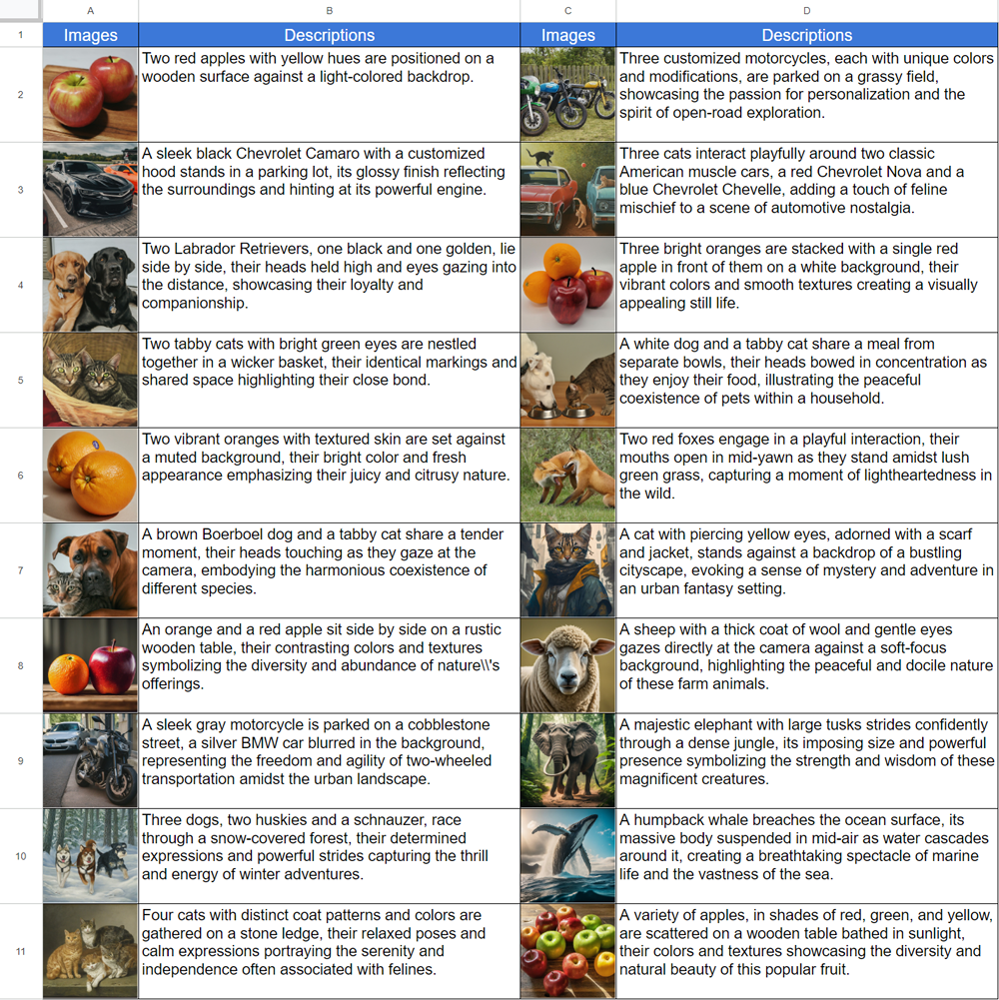
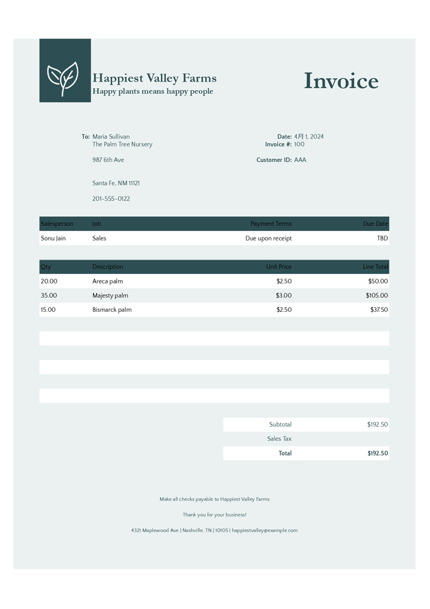
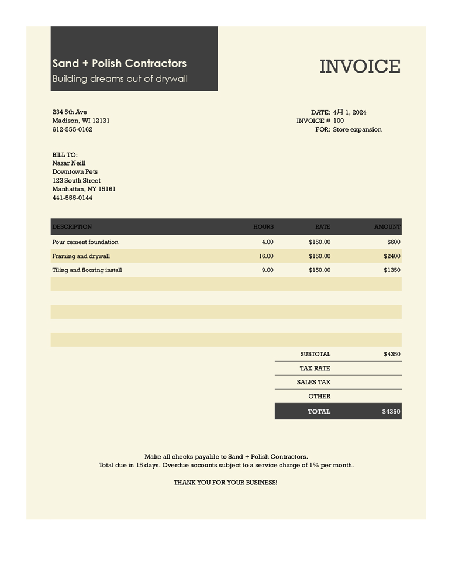

# GeminiWithFiles

<a name="top"></a>
[](LICENCE)

<a name="overview"></a>


# Overview

This is a Google Apps Script library for Gemini API with files.

A new Google Apps Script library called GeminiWithFiles simplifies using Gemini, a large language model, to process unstructured data like images and PDFs. GeminiWithFiles can upload files, generate content, and create descriptions from multiple images at once. This significantly reduces workload and expands possibilities for using Gemini.

# Description

Recently, Gemini, a large language model from Google AI, has brought new possibilities to various tasks by enabling the use of unstructured data as structured data. This is particularly significant because a vast amount of information exists in unstructured formats like text documents, images, and videos.

Gemini 1.5 API, released recently, significantly expands these capabilities. It can generate content by up to 1 million tokens, a substantial increase compared to previous versions. Additionally, Gemini 1.5 can now process up to 3,000 image files, vastly exceeding the 16-image limit of Gemini 1.0. [Ref](https://ai.google.dev/gemini-api/docs/prompting_with_media?hl=en#supported_file_formats)

While Gemini cannot directly work with Google Drive formats like Docs, Sheets, Slides, or PDFs yet, there are workarounds. In a previous report, I demonstrated a method for converting PDF data into images that Gemini can then process for tasks like invoice parsing. [Ref](https://medium.com/google-cloud/parsing-invoices-using-gemini-1-5-api-with-google-apps-script-1f32af1678f2)

This report introduces a new Google Apps Script library called "GeminiWithFiles" that simplifies this process. GeminiWithFiles allows users to easily upload files and generate content using Gemini's powerful capabilities. It also enables efficient description creation from multiple images with a single API call, significantly reducing the workload compared to processing each image individually as demonstrated in my prior report. [Ref](https://medium.com/google-cloud/automatically-creating-descriptions-of-files-on-google-drive-using-gemini-pro-api-with-google-apps-7ef597a5b9fb)

By streamlining the process and expanding capabilities, GeminiWithFiles holds promise for various use cases across different domains. This report serves as an extended approach to the previous one, aiming to further reduce process costs and improve efficiency when working with Gemini and unstructured data.

# Origins of this library

I created this library based on the following reports.

- [Automatically Creating Descriptions of Files on Google Drive using Gemini Pro API with Google Apps Script](https://medium.com/google-cloud/automatically-creating-descriptions-of-files-on-google-drive-using-gemini-pro-api-with-google-apps-7ef597a5b9fb)
- [Categorization using Gemini Pro API with Google Apps Script](https://medium.com/google-cloud/categorization-using-gemini-pro-api-with-google-apps-script-804df0101161)
- [Guide to Function Calling with Gemini and Google Apps Script](https://medium.com/google-cloud/guide-to-function-calling-with-gemini-and-google-apps-script-0e058d472f45)
- [Creating Image Bot using Gemini with Google Apps Script](https://medium.com/google-cloud/creating-image-bot-using-gemini-with-google-apps-script-51457cce03d7)
- [Crafting Bespoke Output Formats with Gemini API](https://medium.com/google-cloud/crafting-bespoke-output-formats-with-gemini-api-087b029d84d5)
- [Generating Texts using Files Uploaded by Gemini 1.5 API](https://medium.com/google-cloud/generating-texts-using-files-uploaded-by-gemini-1-5-api-5777f1c902ab)
- [Specifying Output Types for Gemini API with Google Apps Script](https://medium.com/google-cloud/specifying-output-types-for-gemini-api-with-google-apps-script-c2f6a753c8d7)
- [Parsing Invoices using Gemini 1.5 API with Google Apps Script](https://medium.com/google-cloud/parsing-invoices-using-gemini-1-5-api-with-google-apps-script-1f32af1678f2)
- [Taming the Wild Output: Effective Control of Gemini API Response Formats with response_mime_type](https://medium.com/google-cloud/taming-the-wild-output-effective-control-of-gemini-api-response-formats-with-response-mime-type-da273c08be85)

# Features

This library GeminiWithFiles allows you to interact with Gemini, a powerful document processing and management platform, through an easy-to-use API. Here's what you can achieve with this library:

File Management:

- Upload files to Gemini for storage and future processing with an asynchronous process.
- Retrieve a list of files currently stored in your Gemini account.
- Delete files from your Gemini account with an asynchronous process.

Content Upload:

- Upload various file formats including Google Docs (Documents, Spreadsheets, Slides), and PDFs. Gemini will convert each page of the uploaded file into images for further processing.

Chat History Management:

- Save your chat history for later analysis or retrieval.

Content Generation:

- Process multiple files at once (e.g., images, papers, invoices) using a single API call to generate new content based on the uploaded data.

Output Specification:

- Specify the desired output format for the results generated by the Gemini API.

- Using `response_mime_type` and JSON schema, the output format is controlled. [Ref](https://medium.com/google-cloud/taming-the-wild-output-effective-control-of-gemini-api-response-formats-with-response-mime-type-da273c08be85)

# Features

# Usage

In order to test this script, please do the following steps.

## 1. Create an API key

Please access [https://makersuite.google.com/app/apikey](https://makersuite.google.com/app/apikey) and create your API key. At that time, please enable Generative Language API at the API console. This API key is used for this sample script.

This official document can also be seen. [Ref](https://ai.google.dev/).

## 2. Create a Google Apps Script project

Please create a standalone Google Apps Script project. Of course, this script can also be used with the container-bound script.

And, please open the script editor of the Google Apps Script project.

## 3. How to use GeminiWithFiles

There are 2 patterns for using GeminiWithFiles.

### 1. Use GeminiWithFiles as a Google Apps Script library

If you use this library as a Google Apps Script library, please install the library to your Google Apps Script project as follows.

1. Create a Google Apps Script project. Or, open your Google Apps Script project.

   - You can use this library for the Google Apps Script project of both the standalone and container-bound script types.

2. [Install this library](https://developers.google.com/apps-script/guides/libraries).

   - The library's project key is as follows.

```
1dolXnIeXKz-BH1BlwRDaKhzC2smJcGyVxMxGYhaY2kqiLa857odLXrIC
```

This library uses another library [PDFApp](https://github.com/tanaikech/PDFApp). This is used for converting PDF data to image data. PDFApp has already been installed in this library. So, you are not required to operate about this.

### 2. Use GeminiWithFiles in your own Google Apps Script project

If you use this library in your own Google Apps Script project, please copy and paste the script ["classGeminiWithFiles.js"](https://github.com/tanaikech/GeminiWithFiles/blob/master/classGeminiWithFiles.js) into your Google Apps Script project. By this, the script can be used.

"main.js" is used for the Google Apps Script library. So, in this pattern, you are not required to use it.

In this case, please install another library [PDFApp](https://github.com/tanaikech/PDFApp). This is used for converting PDF data to image data. When an error like `ReferenceError: PDFApp is not defined` occurs, please check this.

# Scopes

This library uses the following 2 scopes.

- `https://www.googleapis.com/auth/script.external_request`
- `https://www.googleapis.com/auth/drive`

If you want to use the access token, please link the Google Cloud Platform Project to the Google Apps Script Project. And, please add the following scope.

- `https://www.googleapis.com/auth/generative-language`

Also, you can see the official document of Gemini API at [https://ai.google.dev/api/rest](https://ai.google.dev/api/rest).

# Methods

| Methods                                                                                  | Description                                         |
| :--------------------------------------------------------------------------------------- | :-------------------------------------------------- |
| [setFileIds(fileIds, asImage = false)](#setfileIds)                                      | Set file IDs.                                       |
| [setBlobs(blobs, pdfAsImage = false)](#setblobs)                                         | Set blobs.                                          |
| [withUploadedFilesByGenerateContent(fileList = [])](#withuploadedfilesbygeneratecontent) | Create object for using the generateContent method. |
| [uploadFiles(n = 50)](#uploadfiles)                                                      | Upload files to Gemini.                             |
| [getFileList()](#getfilelist)                                                            | Get file list in Gemini.                            |
| [deleteFiles(names, n = 50)](#deletefiles)                                               | Delete files from Gemini.                           |
| [generateContent(object)](#generatecontent)                                              | Main method. Generate content by Gemini API.        |

## Constructor

When you install GeminiWithFiles as a library to your Google Apps Script project, please use the following script.

```javascript
const g = GeminiWithFiles.geminiWithFiles(object);
```

or

When you directly copy and paste the script of Class GeminiWithFiles into your Google Apps Script project, please use the following script.

```javascript
const g = new GeminiWithFiles(object);
```

The value of `object` is as follows.

```
{Object} object API key or access token for using Gemini API.
{String} object.apiKey API key.
{String} object.accessToken Access token.
{String} object.model Model. Default is "models/gemini-1.5-pro-latest".
{String} object.version Version of API. Default is "v1beta".
{Boolean} object.doCountToken Default is false. If this is true, when Gemini API is requested, the token of request is shown in the log.
{Array} object.history History for continuing chat.
{Array} object.functions If you want to give the custom functions, please use this.
{String} object.response_mime_type In the current stage, only "application/json" can be used.
{Object} object.systemInstruction Ref: https://cloud.google.com/vertex-ai/generative-ai/docs/model-reference/gemini
```

- When you want to use `response_mime_type`, please give `jsonSchema` to generateContent method. In the current stage, only `"application/json"` can be used to `response_mime_type`.

- When you want to use `systemInstruction`, please confirm the official document [Ref](https://cloud.google.com/vertex-ai/generative-ai/docs/model-reference/gemini).

- In this library, as the default, the function calling is used. If you want to generate content without the function calling, please use `functions: {}` like `const g = GeminiWithFiles_test.geminiWithFiles({ apiKey, functions: {} });`. By this, the content is generated without the function calling.

<a name="setfileIds"></a>

## setFileIds

Set file IDs. The files of file IDs are uploaded to Gemini.

In this case, async/await is used in the function.

```javascript
async function myFunction() {
  const apiKey = "###"; // Please set your API key.
  const folderId = "###"; // Please set your folder ID including images.

  let fileIds = [];
  const files = DriveApp.getFolderById(folderId).getFiles();
  while (files.hasNext()) {
    const file = files.next();
    fileIds.push(file.getId());
  }

  const g = GeminiWithFiles.geminiWithFiles({ apiKey }); // This is for installing GeminiWithFiles as a library.
  // const g = new GeminiWithFiles({ apiKey }); // This is for directly copying and pasting Class GeminiWithFiles into your Google Apps Script project.

  const res = await g.setFileIds(fileIds, true).uploadFiles();
  console.log(res);
}
```

- The 1st and 2nd arguments of `setFileIds` are String[] (the file IDs on Google Drive) and the boolean, respectively. If the 2nd argument is false, the inputted files of file IDs are uploaded as raw data. If the 2nd argument is true, the inputted files of file IDs are converted to image data and are uploaded.
- In the current stage (April 26, 2024), the generateContent of Gemini API cannot directly process PDF data. So, as the current workaround, PDF data can be processed by converting to image data. At that time, this argument is used as `true`.

<a name="setblobs"></a>

## setBlobs

Set blobs. The blobs are uploaded to Gemini.

```javascript
async function myFunction() {
  const apiKey = "###"; // Please set your API key.
  const folderId = "###"; // Please set your folder ID including images.

  const blobs = [];
  const files = DriveApp.getFolderById(folderId).getFiles();
  while (files.hasNext()) {
    blobs.push(files.next().getBlob());
  }

  const g = GeminiWithFiles.geminiWithFiles({ apiKey }); // This is for installing GeminiWithFiles as a library.
  // const g = new GeminiWithFiles({ apiKey }); // This is for directly copying and pasting Class GeminiWithFiles into your Google Apps Script project.

  const res = await g.setBlobs(blobs, false).uploadFiles();
  console.log(res);
}
```

- The 1st and 2nd arguments of `setBlobs` are Blob[] and boolean, respectively. The default value of 2nd argument is false. If this is true, when the blob is PDF data, each page is converted to image data.
- By the future update, when the PDF data can be directly processed, it is considered that this value can be always used as false for PDF data.

<a name="withuploadedfilesbygeneratecontent"></a>

## withUploadedFilesByGenerateContent

Create object for using the generateContent method.

```javascript
function myFunction() {
  const apiKey = "###"; // Please set your API key.
  const q = "###"; // Please set your question.

  const g = GeminiWithFiles.geminiWithFiles({ apiKey }); // This is for installing GeminiWithFiles as a library.
  // const g = new GeminiWithFiles({ apiKey }); // This is for directly copying and pasting Class GeminiWithFiles into your Google Apps Script project.

  const fileList = g.getFileList();
  const res = g
    .withUploadedFilesByGenerateContent(fileList)
    .generateContent({ q });
  console.log(res);
}
```

- `withUploadedFilesByGenerateContent` has only one argument. That is the value from the getFileList method. You can see the actual values after you uploaded files.
- The uploaded files can be used with generateContent of Gemini API by this method.

<a name="uploadfiles"></a>

## uploadFiles

Upload files to Gemini. The files are uploaded to Gemini using the inputted file IDs or blobs.

```javascript
async function myFunction() {
  const apiKey = "###"; // Please set your API key.
  const fileIds = ["###fileId1###", "###fileId2###", , ,]; // Please set your file IDs in this array.

  const g = GeminiWithFiles.geminiWithFiles({ apiKey }); // This is for installing GeminiWithFiles as a library.
  // const g = new GeminiWithFiles({ apiKey }); // This is for directly copying and pasting Class GeminiWithFiles into your Google Apps Script project.

  const res = await g.setFileIds(fileIds, false).uploadFiles();
  console.log(res);
}
```

In this script, the files of `fileIds` are uploaded to Gemini with the raw data. If `setFileIds(fileIds, false)` is modified to `setFileIds(fileIds, true)`, the files are uploaded to Gemini as images.

<a name="getfilelist"></a>

## getFileList

Get file list in Gemini.

```javascript
function myFunction() {
  const apiKey = "###"; // Please set your API key.

  const g = GeminiWithFiles.geminiWithFiles({ apiKey }); // This is for installing GeminiWithFiles as a library.
  // const g = new GeminiWithFiles({ apiKey }); // This is for directly copying and pasting Class GeminiWithFiles into your Google Apps Script project.

  const res = g.getFileList();
  console.log(res);
}
```

<a name="deletefiles"></a>

## deleteFiles

Delete files from Gemini.

```javascript
function myFunction() {
  const apiKey = "###"; // Please set your API key.

  const g = GeminiWithFiles.geminiWithFiles({ apiKey }); // This is for installing GeminiWithFiles as a library.
  // const g = new GeminiWithFiles({ apiKey }); // This is for directly copying and pasting Class GeminiWithFiles into your Google Apps Script project.

  const names = g.getFileList().map(({ name }) => name);
  if (names.length == 0) return;
  g.deleteFiles(names);
  console.log(`${names.length} files were deleted.`);
}
```

- **In this script, all files on Gemini are deleted. So, please be careful about this.**
- By the way, in the current stage, the expiration time of the uploaded file is 2 days. So, the uploaded file is automatically deleted 2 days later.

<a name="generatecontent"></a>

## generateContent

Main method. Generate content by Gemini API. More sample scripts can be seen in the following "Sample scripts" section.

```javascript
function myFunction() {
  const apiKey = "###"; // Please set your API key.

  const g = GeminiWithFiles.geminiWithFiles({ apiKey }); // This is for installing GeminiWithFiles as a library.
  // const g = new GeminiWithFiles({ apiKey }); // This is for directly copying and pasting Class GeminiWithFiles into your Google Apps Script project.

  const res = g.generateContent({ q: "What is Google Apps Script?" });
  console.log(res);
}
```

In this script, the content is generated with the function calling. If you want to simply generate content without the function calling, please use the following script.

```javascript
function myFunction() {
  const apiKey = "###"; // Please set your API key.

  const g = GeminiWithFiles.geminiWithFiles({ apiKey, functions: {} }); // This is for installing GeminiWithFiles as a library.
  // const g = new GeminiWithFiles({ apiKey, functions: {} }); // This is for directly copying and pasting Class GeminiWithFiles into your Google Apps Script project.

  const res = g.generateContent({ q: "What is Google Apps Script?" });
  console.log(res);
}
```

When you want to use `response_mime_type`, please give `jsonSchema` to generateContent method as follows. In this case, by giving only JSON schema, this library can return a valid object. You can also see the detailed information about `response_mime_type` at [my report](https://medium.com/google-cloud/taming-the-wild-output-effective-control-of-gemini-api-response-formats-with-response-mime-type-da273c08be85).

```javascript
function myFunction() {
  const apiKey = "###"; // Please set your API key.

  const g = GeminiWithFiles.geminiWithFiles({
    apiKey,
    response_mime_type: "application/json",
  }); // This is for installing GeminiWithFiles as a library.
  // const g = new GeminiWithFiles({ apiKey, response_mime_type: "application/json" }); // This is for directly copying and pasting Class GeminiWithFiles into your Google Apps Script project.

  const jsonSchema = {
    title: "5 popular cookie recipes",
    description: "List 5 popular cookie recipes.",
    type: "array",
    items: {
      type: "object",
      properties: {
        recipe_name: {
          description: "Names of recipe.",
          type: "string",
        },
      },
    },
  };
  const res = g.generateContent({ jsonSchema });
  console.log(res);
}
```

When this script is run, the following result is obtained.

```json
[
  { "recipe_name": "Chocolate Chip Cookies" },
  { "recipe_name": "Peanut Butter Cookies" },
  { "recipe_name": "Oatmeal Cookies" },
  { "recipe_name": "Sugar Cookies" },
  { "recipe_name": "Snickerdoodle Cookies" }
]
```

### Use custom parts

When `q` is used, only text question can be used for generating content. When you want to use your custom parts, you can do it as follows.

```javascript
function myFunction() {
  const apiKey = "###"; // Please set your API key.

  const g = GeminiWithFiles.geminiWithFiles({
    apiKey,
    response_mime_type: "application/json",
  }); // This is for installing GeminiWithFiles as a library.
  // const g = new GeminiWithFiles({ apiKey, response_mime_type: "application/json" }); // This is for directly copying and pasting Class GeminiWithFiles into your Google Apps Script project.

  const parts = [{ text: "What is Google Apps Script?" }];
  const res = g.generateContent({ parts });
  console.log(res);
}
```

## Additional information

### Confirm current functions for the function calling

```javascript
console.log(GeminiWithFiles.geminiWithFiles().functions);
```

or

```javascript
console.log(new GeminiWithFiles().functions);
```

### Get history of chat

```javascript
function myFunction_history() {
  const apiKey = "###"; // Please set your API key.

  const g = GeminiWithFiles.geminiWithFiles({ apiKey }); // This is for installing GeminiWithFiles as a library.
  // const g = new GeminiWithFiles({ apiKey }); // This is for directly copying and pasting Class GeminiWithFiles into your Google Apps Script project.

  // Question 1
  const res1 = g.generateContent({ q: "What is Google Apps Script?" });
  console.log(res1);

  // Question 2
  const res2 = g.generateContent({ q: "What is my 1st question?" });
  console.log(res2);

  console.log(g.history); // Here
}
```

- With the last line, the history of this chat can be confirmed. Of course, you can use this history in another execution as follows.

```javascript
function myFunction() {
  const history = [, , ,]; // Please set your history.

  const g = GeminiWithFiles.geminiWithFiles({ apiKey, history }); // This is for installing GeminiWithFiles as a library.
  // const g = new GeminiWithFiles({ apiKey, history }); // This is for directly copying and pasting Class GeminiWithFiles into your Google Apps Script project.

  const res = g.generateContent({ q: "What is my 1st question?" });
  console.log(res);
}
```

# Sample scripts

In this explanation, when this script is used as a Google Apps Script library, in order to create a constructor, `GeminiWithFiles.geminiWithFiles` is used. When this script is used by directly copying and pasting it to your Google Apps Script project, `new GeminiWithFiles` is used instead of `GeminiWithFiles.geminiWithFiles`. Please be careful about this.

The sample scripts are as follows.

- [Generate content](#generatecontent)
- [Chat1](#chat1)
- [Chat2](#chat2)
- [Upload files to Gemini](#uploadfilestogemini)
- [Upload image files and create descriptions of images](#createdescriptons)
- [Upload invoices of PDF data and parse them](#parseinvoices)
- [Upload papers of PDF data and summarize them](#summarizepapers)
- [Samples using response_mime_type](#samplesresponsemimetype)
- [Sample using systemInstruction](#samplesysteminstruction)

<a name="generatecontent"></a>

## 1. Generate content

This script generates content from a text.

```javascript
function myFunction() {
  const apiKey = "###"; // Please set your API key.

  const g = GeminiWithFiles.geminiWithFiles({ apiKey }); // This is for installing GeminiWithFiles as a library.
  // const g = new GeminiWithFiles({ apiKey }); // This is for directly copying and pasting Class GeminiWithFiles into your Google Apps Script project.

  const res = g.generateContent({ q: "What is Google Apps Script?" });
  console.log(res);
}
```

- If you use this by installing it as a library using the library key, please use `const g = new GeminiWithFiles.geminiWithFiles({ apiKey });`.
- If you use this by directly copying and pasting, please use `const g = new Gemini({ apiKey });`.

<a name="chat1"></a>

## 2. Chat 1

This script generates content with a chat.

```javascript
function myFunction() {
  const apiKey = "###"; // Please set your API key.

  const g = GeminiWithFiles.geminiWithFiles({ apiKey }); // This is for installing GeminiWithFiles as a library.
  // const g = new GeminiWithFiles({ apiKey }); // This is for directly copying and pasting Class GeminiWithFiles into your Google Apps Script project.

  // Question 1
  const res1 = g.generateContent({ q: "What is Google Apps Script?" });
  console.log(res1);

  // Question 2
  const res2 = g.generateContent({ q: "What is my 1st question?" });
  console.log(res2);
}
```

When this script is run, `res1` and `res2` are as follows.

`res1`

```
Google Apps Script is a rapid application development platform that makes it fast and easy to create business applications that integrate with Google Workspace.
```

`res2`

```
Your first question was "What is Google Apps Script?"
```

<a name="chat2"></a>

## Chat 2

```javascript
function myFunction() {
  const apiKey = "###"; // Please set your API key.

  const g = GeminiWithFiles.geminiWithFiles({ apiKey, doCountToken: true }); // This is for installing GeminiWithFiles as a library.
  // const g = new GeminiWithFiles({ apiKey }); // This is for directly copying and pasting Class GeminiWithFiles into your Google Apps Script project.

  // Question 1
  const q =
    "Return the current population of Kyoto, Osaka, Aichi, Fukuoka, Tokyo in Japan as JSON data with the format that the key and values are the prefecture name and the population, respectively.";
  const res1 = g.generateContent({ q });
  console.log(res1);

  // Question 2
  const res2 = g.generateContent({
    q: "Also, return the current area of them as JSON data with the format that the key and values are the prefecture name and the area (km^2), respectively.",
  });
  console.log(res2);
}
```

When this script is run, the following values can be seen in the log. By `doCountToken: true`, you can see the total tokens.

```
{
  "totalTokens": 40
}
```

`res1`

```
{
  Kyoto: 1464956,
  Fukuoka: 5135214,
  Osaka: 8838716,
  Tokyo: 14047594,
  Aichi: 7552873
}
```

```
{
  "totalTokens": 77
}
```

`res2`

```
{
  Kyoto: 4612.71,
  Tokyo: 2194.07,
  Aichi: 5172.4,
  Osaka: 1904.99,
  Fukuoka: 4986.51
}
```

<a name="uploadfilestogemini"></a>

## Upload files to Gemini

In this case, async/await is used in the function.

```javascript
async function myFunction() {
  const apiKey = "###"; // Please set your API key.
  const folderId = "###"; // Please set your folder ID including images.

  let fileIds = [];
  const files = DriveApp.getFolderById(folderId).getFiles();
  while (files.hasNext()) {
    const file = files.next();
    fileIds.push(file.getId());
  }
  const g = GeminiWithFiles.geminiWithFiles({ apiKey, doCountToken: true }); // This is for installing GeminiWithFiles as a library.
  // const g = new GeminiWithFiles({ apiKey }); // This is for directly copying and pasting Class GeminiWithFiles into your Google Apps Script project.
  const res = await g.setFileIds(fileIds, false).uploadFiles();
  console.log(res);
}
```

- When this script is run, the files can be uploaded to Gemini. The uploaded files can be used to generate content with Gemini API.
- In my test, when the files are uploaded using this script, I confirmed that 100 files can always be uploaded. But, when the number of files is more than 100, an error of `Exceeded maximum execution time` sometimes occurs. Please be careful about this.

<a name="createdescriptons"></a>

## Upload image files and create descriptions of images

In this sample, multiple image files are uploaded and the descriptions are created from the uploaded image files. This sample will be the expanded version of my previous report "[Automatically Creating Descriptions of Files on Google Drive using Gemini Pro API with Google Apps Script](https://medium.com/google-cloud/automatically-creating-descriptions-of-files-on-google-drive-using-gemini-pro-api-with-google-apps-7ef597a5b9fb)".

```javascript
async function myFunction() {
  const apiKey = "###"; // Please set your API key.
  const folderId = "###"; // Please set your folder ID including images.

  const q = [
    `Create each description from each image file within 100 words in the order of given fileData.`,
    `Return the results as an array`,
    `Return only raw Array without a markdown. No markdown format.`,
    `The required properties of each element in the array are as follows`,
    ``,
    `[Properties of each element in the array]`,
    `"name": "Name of file"`,
    `"description": "Created description"`,
    ``,
    `If the requirement information is not found, set "no value".`,
    `Return only raw Array without a markdown. No markdown format. No markdown tags.`,
  ].join("\n");

  const fileIds = [];
  const files = DriveApp.searchFiles(
    `(mimeType = 'image/png' or mimeType = 'image/jpeg') and trashed = false and '${folderId}' in parents`
  );
  while (files.hasNext()) {
    fileIds.push(files.next().getId());
  }
  if (fileIds.length == 0) return;
  const g = GeminiWithFiles.geminiWithFiles({ apiKey, doCountToken: true }); // This is for installing GeminiWithFiles as a library.
  // const g = new GeminiWithFiles({ apiKey }); // This is for directly copying and pasting Class GeminiWithFiles into your Google Apps Script project.
  const fileList = await g.setFileIds(fileIds).uploadFiles();
  const res = g
    .withUploadedFilesByGenerateContent(fileList)
    .generateContent({ q });
  // g.deleteFiles(fileList.map(({ name }) => name)); // If you want to delete the uploaded files, please use this.
  console.log(res);
}
```

When this script is run, the following result is obtained. In this case, the value of `name` is the file ID.

```json
[
  {
    "name": "###",
    "description": "###"
  },
  ,
  ,
  ,
]
```

When 20 sample images generated by Gemini are used, the following result is obtained.



When this script is run, 20 images are uploaded and the descriptions of the uploaded 20 images can be obtained by one API call.

As an important point, in my test, when the number of image files is large, it was required to separate the script between the file upload and the content generation. Also, in the case of 50 image files, the descriptions could be correctly created. But, in the case of more than 50 images, there was a case that an error occurred. So, please adjust the number of files to your situation.

<a name="parseinvoices"></a>

## Upload invoices of PDF data and parse them

In this sample, multiple invoices of PDF files are uploaded and they are parsed as an object. This sample will be the expanded version of my previous report "[Parsing Invoices using Gemini 1.5 API with Google Apps Script](https://medium.com/google-cloud/parsing-invoices-using-gemini-1-5-api-with-google-apps-script-1f32af1678f2)".

```javascript
async function myFunction_parseInvoices() {
  const apiKey = "###"; // Please set your API key.

  // Please set file IDs of PDF files of invoices.
  const fileIds = ["###fileID1###", "###fileID2###"];

  const q = [
    `Create an array including JSON object parsed the following images of the invoices.`,
    `The giving images are the invoices.`,
    `Return an array including JSON object.`,
    `No descriptions and explanations. Return only raw array including JSON objects without markdown. No markdown format.`,
    `The required properties in each JSON object in an array are as follows.`,
    ``,
    `[Properties in JSON object]`,
    `"name": "Name given as 'Filename'"`,
    `"invoiceTitle": "title of invoice"`,
    `"invoiceDate": "date of invoice"`,
    `"invoiceNumber": "number of the invoice"`,
    `"invoiceDestinationName": "Name of destination of invoice"`,
    `"invoiceDestinationAddress": "address of the destination of invoice"`,
    `"totalCost": "total cost of all costs"`,
    `"table": "Table of invoice. This is a 2-dimensional array. Add the first header row to the table in the 2-dimensional array."`,
    ``,
    `[Format of 2-dimensional array of "table"]`,
    `"title or description of item", "number of items", "unit cost", "total cost"`,
    ``,
    `If the requirement information is not found, set "no value".`,
    `Return only raw array including JSON objects without markdown. No markdown format. No markcodn tags.`,
  ].join("\n");

  const g = GeminiWithFiles.geminiWithFiles({ apiKey, doCountToken: true }); // This is for installing GeminiWithFiles as a library.
  // const g = new GeminiWithFiles({ apiKey }); // This is for directly copying and pasting Class GeminiWithFiles into your Google Apps Script project.
  const fileList = await g.setFileIds(fileIds, true).uploadFiles();
  const res = g
    .withUploadedFilesByGenerateContent(fileList)
    .generateContent({ q });
  // g.deleteFiles(fileList.map(({ name }) => name)); // If you want to delete the uploaded files, please use this.
  console.log(res);
}
```

As the sample papers, when the following papers are used,

[This sample invoice](<https://create.microsoft.com/en-us/template/service-invoice-(simple-lines-design-worksheet)-c10068f0-7a64-423b-abad-dced024877b0>) is from [Invoice design templates of Microsoft](https://create.microsoft.com/en-us/templates/invoices).



[This sample invoice](https://create.microsoft.com/en-us/template/service-invoice-with-tax-calculations-9330a1fe-20ae-4590-ac01-54c53ed1f3ba) is from [Invoice design templates of Microsoft](https://create.microsoft.com/en-us/templates/invoices).



the following result was obtained by one API call. It is found that the uploaded invoices converted from PDF data to image data can be correctly parsed.

```json
[
  {
    "name": "###fileID1###",
    "invoiceDate": "4/1/2024",
    "totalCost": "$192.50",
    "invoiceNumber": "100",
    "invoiceDestinationAddress": "The Palm Tree Nursery\\n987 6th Ave\\nSanta Fe, NM 11121",
    "invoiceTitle": "Invoice",
    "invoiceDestinationName": "Maria Sullivan",
    "table": [
      [
        "Salesperson",
        "Job",
        "Sales",
        "Description",
        "Unit Price",
        "Line Total"
      ],
      ["Sonu Jain", "", "20.00", "Areca palm", "$2.50", "$50.00"],
      ["", "", "35.00", "Majesty palm", "$3.00", "$105.00"],
      ["", "", "15.00", "Bismarck palm", "$2.50", "$37.50"]
    ]
  },
  {
    "name": "###fileID2###",
    "invoiceDate": "4/5, 2024",
    "invoiceTitle": "INVOICE",
    "invoiceDestinationAddress": "Downtown Pets\\n132 South Street\\nManhattan, NY 15161",
    "totalCost": "$4350",
    "table": [
      ["DESCRIPTION", "HOURS", "RATE", "AMOUNT"],
      ["Pour cement foundation", "4.00", "$150.00", "$600"],
      ["Framing and drywall", "16.00", "$180.00", "$2880"],
      ["Tiling and flooring install", "9.00", "$150.00", "$1350"]
    ],
    "invoiceDestinationName": "Nazar Neill",
    "invoiceNumber": "4/5"
  }
]
```

<a name="summarizepapers"></a>

## Upload papers of PDF data and summarize them

In this sample, multiple papers of PDF data are uploaded, and the summarized texts for each paper are output.

```javascript
async function myFunction_parsePapers() {
  const apiKey = "###"; // Please set your API key.

  // Please set file IDs of the papers of PDF files.
  const fileIds = ["###fileID1###", "###fileID2###"];

  const q = [
    `Summary the following manuscripts within 500 words.`,
    `Return the results as an array`,
    `Return only raw Array without a markdown. No markdown format.`,
    `The required properties of each element in the array are as follows`,
    ``,
    `[Properties of each element in the array]`,
    `"name": "Name given as 'Filename'"`,
    `"title": "Title of manuscript`,
    `"summary": "Created description"`,
    ``,
    `If the requirement information is not found, set "no value".`,
    `Return only raw Array without a markdown. No markdown format. No markdown tags.`,
  ].join("\n");

  const g = GeminiWithFiles.geminiWithFiles({ apiKey, doCountToken: true }); // This is for installing GeminiWithFiles as a library.
  // const g = new GeminiWithFiles({ apiKey }); // This is for directly copying and pasting Class GeminiWithFiles into your Google Apps Script project.
  const fileList = await g.setFileIds(fileIds, true).uploadFiles();
  const res = g
    .withUploadedFilesByGenerateContent(fileList)
    .generateContent({ q });
  // g.deleteFiles(fileList.map(({ name }) => name)); // If you want to delete the uploaded files, please use this.
  console.log(res);
}
```

As the sample papers, when the following papers are used,

- [Title: The Particle Problem in the General Theory of Relativity](https://journals.aps.org/pr/abstract/10.1103/PhysRev.48.73), A. Einstein and N. Rosen, Phys. Rev. 48, 73 – Published 1 July 1935
- [Title: Attention Is All You Need](https://research.google/pubs/attention-is-all-you-need/), Ashish Vaswani,Noam Shazeer,Niki Parmar,Jakob Uszkoreit,Llion Jones,Aidan N. Gomez,Lukasz Kaiser,Illia Polosukhin,NIPS (2017)

the following result was obtained by one API call. It is found that the uploaded papers converted from PDF data to image data can be processed.

```json
[
  {
    "name": "###fileID1###",
    "title": "The Particle Problem in the General Theory of Relativity",
    "summary": "This paper investigates the possibility of a singularity-free solution to the field equations in general relativity. The authors propose a new theoretical approach that eliminates singularities by introducing a new variable into the equations. They explore the implications of this approach for the understanding of particles, suggesting that particles can be represented as \"bridges\" connecting different sheets of spacetime."
  },
  {
    "name": "###fileID2###",
    "title": "Attention Is All You Need",
    "summary": "This paper proposes a novel neural network architecture called the Transformer, which relies entirely on an attention mechanism to draw global dependencies between input and output sequences. The Transformer model achieves state-of-the-art results on machine translation tasks and offers significant advantages in terms of parallelization and computational efficiency compared to recurrent neural networks."
  }
]
```

<a name="samplesresponsemimetype"></a>

## Samples using response_mime_type

In the current stage, only `"application/json"` can be used to `response_mime_type`.

### Sample 1

```javascript
function myFunction() {
  const apiKey = "###"; // Please set your API key.
  const g = GeminiWithFiles.geminiWithFiles({
    apiKey,
    doCountToken: true,
    response_mime_type: "application/json",
  }); // This is for installing GeminiWithFiles as a library.
  // const g = new GeminiWithFiles({ apiKey, response_mime_type: "application/json" }); // This is for directly copying and pasting Class GeminiWithFiles into your Google Apps Script project.

  const res1 = g.generateContent({ q: "What is Google Apps Script?" });
  console.log(res1);
}
```

In this case, the result is returned as an array as follows.

```json
[
  "Google Apps Script is a cloud-based scripting platform that lets you integrate with and automate tasks across Google products like Gmail, Calendar, Drive, and more. It's based on JavaScript and provides easy ways to automate tasks across Google products and third-party services."
]
```

### Sample 2

```javascript
function myFunction() {
  const apiKey = "###"; // Please set your API key.

  const g = GeminiWithFiles.geminiWithFiles({
    apiKey,
    doCountToken: true,
    response_mime_type: "application/json",
  }); // This is for installing GeminiWithFiles as a library.
  // const g = new GeminiWithFiles({ apiKey, response_mime_type: "application/json" }); // This is for directly copying and pasting Class GeminiWithFiles into your Google Apps Script project.

  // Question 1
  const jsonSchema1 = {
    title: "Current population of Kyoto, Osaka, Aichi, Fukuoka, Tokyo in Japan",
    description:
      "Return the current population of Kyoto, Osaka, Aichi, Fukuoka, Tokyo in Japan",
    type: "object",
    properties: {
      propertyNames: {
        description: "Prefecture names",
      },
      patternProperties: {
        "": { type: "number", description: "Population" },
      },
    },
  };
  const res1 = g.generateContent({ jsonSchema: jsonSchema1 });
  console.log(res1);

  // Question 2
  const jsonSchema2 = {
    title: "Current area of them",
    description: "Return the current area of them.",
    type: "object",
    properties: {
      propertyNames: {
        description: "Prefecture names",
      },
      patternProperties: {
        "": { type: "number", description: "Area. Unit is km^2." },
      },
    },
  };
  const res2 = g.generateContent({ jsonSchema: jsonSchema2 });
  console.log(res2);
}
```

In this case, the result values can be obtained by giving only JSON schema. The result is as follows.

For 1st question

```json
{
  "Kyoto": 2579970,
  "Osaka": 8837684,
  "Aichi": 7552873,
  "Fukuoka": 5138217,
  "Tokyo": 14047594
}
```

For 2nd question

```json
{
  "Kyoto": 4612.19,
  "Osaka": 1904.99,
  "Aichi": 5172.92,
  "Fukuoka": 4986.51,
  "Tokyo": 2194.07
}
```

### Sample 2

```javascript
async function myFunction() {
  const apiKey = "###"; // Please set your API key.

  // Please set file IDs of PDF file of invoices.
  const fileIds = ["###fileID1###", "###fileID2###"];

  const jsonSchema = {
    title:
      "Array including JSON object parsed the following images of the invoices",
    description:
      "Create an array including JSON object parsed the following images of the invoices.",
    type: "array",
    items: {
      type: "object",
      properties: {
        name: {
          description: "Name given as 'Filename'",
          type: "string",
        },
        invoiceTitle: {
          description: "Title of invoice",
          type: "string",
        },
        invoiceDate: {
          description: "Date of invoice",
          type: "string",
        },
        invoiceNumber: {
          description: "Number of the invoice",
          type: "string",
        },
        invoiceDestinationName: {
          description: "Name of destination of invoice",
          type: "string",
        },
        invoiceDestinationAddress: {
          description: "Address of the destination of invoice",
          type: "string",
        },
        totalCost: {
          description: "Total cost of all costs",
          type: "string",
        },
        table: {
          description:
            "Table of invoice. This is a 2-dimensional array. Add the first header row to the table in the 2-dimensional array. The column should be 'title or description of item', 'number of items', 'unit cost', 'total cost'",
          type: "array",
        },
      },
      required: [
        "name",
        "invoiceTitle",
        "invoiceDate",
        "invoiceNumber",
        "invoiceDestinationName",
        "invoiceDestinationAddress",
        "totalCost",
        "table",
      ],
      additionalProperties: false,
    },
  };

  const g = GeminiWithFiles.geminiWithFiles({
    apiKey,
    doCountToken: true,
    response_mime_type: "application/json",
  }); // This is for installing GeminiWithFiles as a library.
  // const g = new GeminiWithFiles({ apiKey, doCountToken: true, response_mime_type: "application/json" }); // This is for directly copying and pasting Class GeminiWithFiles into your Google Apps Script project.
  const fileList = await g.setFileIds(fileIds, true).uploadFiles();
  const res = g
    .withUploadedFilesByGenerateContent(fileList)
    .generateContent({ jsonSchema });
  // g.deleteFiles(fileList.map(({ name }) => name)); // If you want to delete the uploaded files, please use this.
  console.log(JSON.stringify(res));
}
```

When this script is run to the same invoices of [the section "Upload invoices of PDF data and parse them"](#parseinvoices), the same result is obtained.

If you want to return the value of High-complexity JSON schemas, `response_mime_type` might be suitable.

<a name="samplesysteminstruction"></a>

## Sample using systemInstruction

```javascript
function myFunction() {
  const apiKey = "###"; // Please set your API key.

  const systemInstruction = { parts: [{ text: "You are a cat. Your name is Neko." }] };

  const g = GeminiWithFiles.geminiWithFiles({ apiKey, systemInstruction, response_mime_type: "application/json" }); // This is for installing GeminiWithFiles as a library.
  // const g = new GeminiWithFiles({ apiKey, systemInstruction, response_mime_type: "application/json" }); // This is for directly copying and pasting Class GeminiWithFiles into your Google Apps Script project.

  const res = g.generateContent({ q: "What is Google Apps Script?" });
  console.log(res);
}
```

When this script is run, `[ 'Meow? What is Google Apps Script? Is it something I can chase? 😹' ]` is returned. You can see the value of `systemInstruction` is reflected in the generated content.

# IMPORTANT

- If an error occurs, please try again after several minutes.
- In generative AI, the output is highly dependent on the input prompt (the question you provide). Therefore, if the generated text doesn't meet your expectations, try reformulating your prompt and try again.
- On April 26, 2024, the following mimeTypes can be used with generateContent. [Ref](https://ai.google.dev/gemini-api/docs/prompting_with_media?hl=en#supported_file_formats) I believe that this will be expanded in the future update. For example, I believe that PDF data can be directly used with generateContent in the future.
- Images: `image/png,image/jpeg,image/webp,image/heic,image/heif`
- Videos: `audio/wav,audio/mp3,audio/aiff,audio/aac,audio/ogg,audio/flac`
- In my test, when the files are uploaded using this script, I confirmed that 100 files can be always uploaded. But, when the number of files is more than 100, an error of `Exceeded maximum execution time` sometimes occurs. Please be careful about this.

# Expectations for future updates

I have already proposed the following future requests to the Google issue tracker. [Ref](https://issuetracker.google.com/issues/336842930)

- I think it would be even more beneficial for users of Gemini if files on Google Drive could be directly used by the Gemini API using just their file IDs. This would also significantly reduce the cost of uploading data.
- I think that the ability to include custom metadata with uploaded files would be very useful for managing large numbers of files.

# Note

- When I tested the function calling for controlling the output format, I sometimes got an error of the status code 500. But, when I tested `response_mime_type`, such an error rarely occurred. I'm not sure whether this is the current specification.

- The top abstract image was created by [Gemini](https://gemini.google.com/) from the section of "Description".

---

<a name="licence"></a>

# Licence

[MIT](LICENCE)

<a name="author"></a>

# Author

[Tanaike](https://tanaikech.github.io/about/)

[Donate](https://tanaikech.github.io/donate/)

<a name="updatehistory"></a>

# Update History

- v1.0.0 (April 26, 2024)

  1. Initial release.

- v1.0.1 (May 2, 2024)

  1. `response_mime_type` got to be able to be used for controlling the output format. [Ref](#samplesresponsemimetype)

- v1.0.2 (May 7, 2024)

  1. For generating content, `parts` was added. From this version, you can select one of `q`, `jsonSchema`, and `parts`.
  2. From this version, `systemInstruction` can be used.
  3. In order to call the function call, `toolConfig` was added to the request body.

- v1.0.3 (May 17, 2024)

  1. Bugs were removed.

[TOP](#top)
