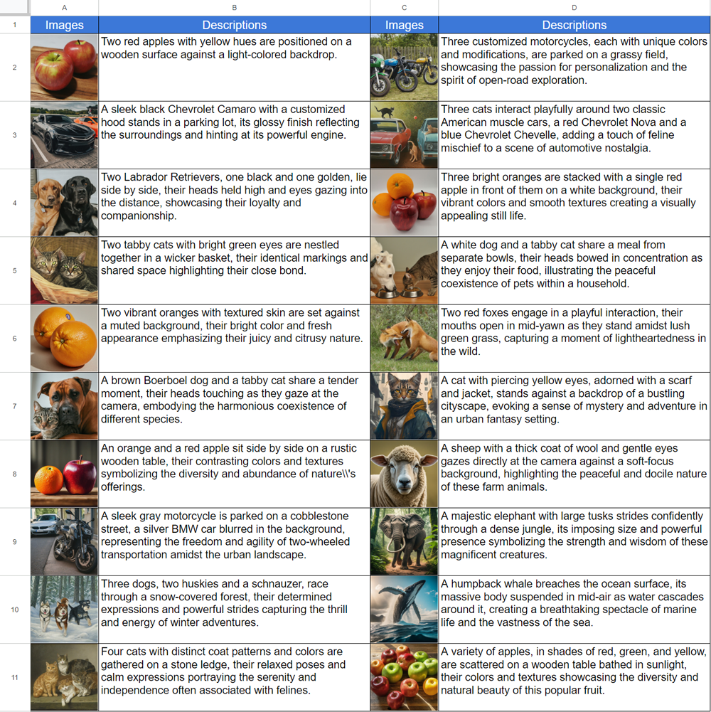
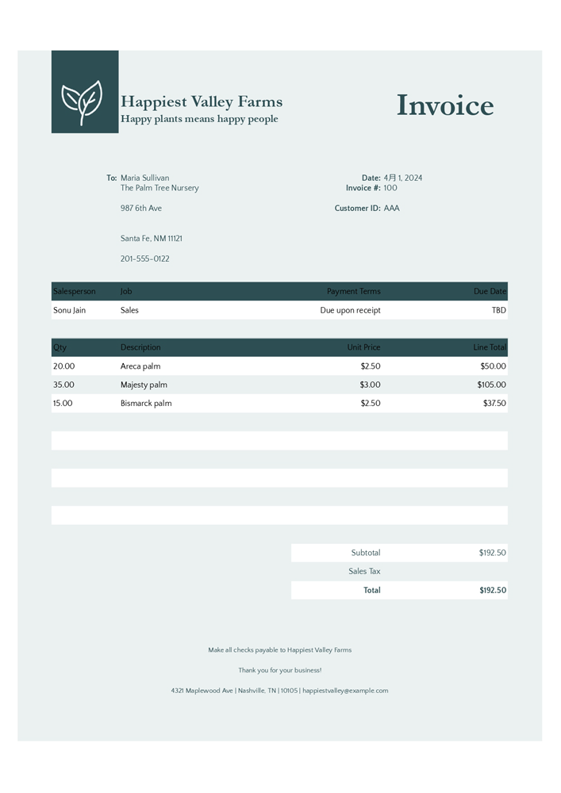
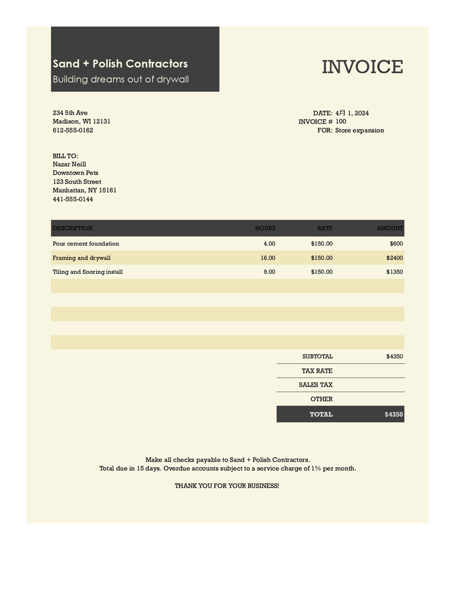

# GeminiWithFiles

<a name="top"></a>
[](LICENCE)

# IMPORTANT

Gemini API is continually growing and evolving. With the release of GeminiWithFiles v2.x.x (and the latest v2.0.16), the library has undergone major updates, including support for the latest **Gemini 3.0 Flash Preview** model and **Agent Skills** (Progressive Disclosure architecture and Subagent Orchestration).

If you want to use the legacy GeminiWithFiles v1.x.x, please see [here](old_v1.x.x/README.md).

<a name="overview"></a>


# Overview

**GeminiWithFiles** is a powerful Google Apps Script (GAS) library designed to streamline interactions with the Gemini API, particularly when working with files and unstructured data.

By utilizing this library, developers can effortlessly upload files (images, PDFs, videos, etc.), generate text or structured JSON content, execute code, perform Google Search grounding, and even build autonomous AI agents using **Agent Skills**. This significantly reduces coding overhead and expands the possibilities of integrating Gemini into Google Workspace.

# Description

As large language models (LLMs) continue to advance, Google's Gemini models have opened up unprecedented possibilities for converting unstructured data (like images, videos, and PDFs) into structured, actionable insights.

With the latest **Gemini 3.0** capabilities, the context window and multimodal processing power have reached new heights. You can now analyze massive documents, batch-process images, and natively interpret PDF data directly without third-party conversions. [Ref](https://ai.google.dev/gemini-api/docs/prompting_with_media?hl=en#supported_file_formats) [Ref](https://medium.com/google-cloud/gemini-api-revolutionizing-content-generation-with-direct-pdf-input-105493780fa4)

While Gemini does not natively parse Google Workspace proprietary formats (Docs, Sheets, Slides) directly, we can use workarounds like converting them to PDF and leveraging the Gemini API's direct PDF input features.

**GeminiWithFiles** abstracts away the complexities of making direct REST API calls from Apps Script. It handles the nuances of multipart uploads, resumable uploads for large files (>50MB), token counting, and multi-turn chat context. More importantly, the latest version introduces **Agent Skills**, allowing developers to create dynamic, autonomous agent workflows where the model decides which tools to use, reads configurations from Google Drive, dynamically executes JavaScript in your GAS environment, and even delegates tasks to specialized subagents. [Ref](https://medium.com/google-cloud/automatically-creating-descriptions-of-files-on-google-drive-using-gemini-pro-api-with-google-apps-7ef597a5b9fb)

By simplifying implementation and broadening the scope of what Apps Script can do, GeminiWithFiles helps developers rapidly build AI-driven solutions across various domains with minimal boilerplate.

# Origins of this library

I created this library based on the concepts explored in my research and reports below.

## Applications

- [Automatically Creating Descriptions of Files on Google Drive using Gemini Pro API with Google Apps Script](https://medium.com/google-cloud/automatically-creating-descriptions-of-files-on-google-drive-using-gemini-pro-api-with-google-apps-7ef597a5b9fb)
- [Categorization using Gemini Pro API with Google Apps Script](https://medium.com/google-cloud/categorization-using-gemini-pro-api-with-google-apps-script-804df0101161)
- [Guide to Function Calling with Gemini and Google Apps Script](https://medium.com/google-cloud/guide-to-function-calling-with-gemini-and-google-apps-script-0e058d472f45)
- [Creating Image Bot using Gemini with Google Apps Script](https://medium.com/google-cloud/creating-image-bot-using-gemini-with-google-apps-script-51457cce03d7)
- [Crafting Bespoke Output Formats with Gemini API](https://medium.com/google-cloud/crafting-bespoke-output-formats-with-gemini-api-087b029d84d5) -[Generating Texts using Files Uploaded by Gemini 1.5 API](https://medium.com/google-cloud/generating-texts-using-files-uploaded-by-gemini-1-5-api-5777f1c902ab)
- [Specifying Output Types for Gemini API with Google Apps Script](https://medium.com/google-cloud/specifying-output-types-for-gemini-api-with-google-apps-script-c2f6a753c8d7)
- [Parsing Invoices using Gemini 1.5 API with Google Apps Script](https://medium.com/google-cloud/parsing-invoices-using-gemini-1-5-api-with-google-apps-script-1f32af1678f2)
- [Taming the Wild Output: Effective Control of Gemini API Response Formats with response_mime_type](https://medium.com/google-cloud/taming-the-wild-output-effective-control-of-gemini-api-response-formats-with-response-mime-type-da273c08be85)
- [Gemini API with JSON schema](https://medium.com/google-cloud/gemini-api-with-json-schema-3dbdabac7d19)
- [Taming the Wild Output: Effective Control of Gemini API Response Formats with response_schema](https://medium.com/google-cloud/taming-the-wild-output-effective-control-of-gemini-api-response-formats-with-response-schema-ae0097b97502)
- [Harnessing Gemini’s Power: A Guide to Generating Content from Structured Data](https://medium.com/google-cloud/harnessing-geminis-power-a-guide-to-generating-content-from-structured-data-45080dac0bbb)
- [Streamlining Gmail Processing Including Attachment Files Using Gemini with Google Apps Script](https://medium.com/google-cloud/streamlining-gmail-processing-including-attachment-files-using-gemini-with-google-apps-script-ce4078abb6bf)
- [Generate Images with Gemini API using Google Apps Script](https://medium.com/google-cloud/generate-images-with-gemini-api-using-google-apps-script-a7c04c0a4843)
- [Create Visualized Recipe Instructions with Gemini using Google Apps Script](https://medium.com/google-cloud/create-visualized-recipe-instructions-with-gemini-using-google-apps-script-3f9e3fcb9a0b)
- [Generate Growing Images using Gemini API](https://medium.com/google-cloud/generate-growing-images-using-gemini-api-3de7638e47fd)
- [Roadmap Generator as Gemini](https://medium.com/google-cloud/roadmap-generator-as-gemini-e4a82d7764ad)
- [Stowage Planning Automation Using Gemini: A Feasibility Study and A Prompt-Based Approach](https://medium.com/google-cloud/stowage-planning-automation-using-gemini-a-feasibility-study-and-a-prompt-based-approach-af8dd264e35d)
- [Integrating Gemini and Google Apps Script for Automated Google Slides Presentations](https://medium.com/google-cloud/integrating-gemini-and-google-apps-script-for-automated-google-slides-presentations-626eedc83166)
- [A Developer’s Guide to Understanding Agent Skills: Implementing Progressive Disclosure in Google Apps Script](https://medium.com/google-cloud/a-developers-guide-to-understanding-agent-skills-7cb8d3d2ce91)

## Standardization protocols in the AI ecosystem

- [Building Model Context Protocol (MCP) Server with Google Apps Script](https://medium.com/google-cloud/building-model-context-protocol-mcp-server-with-google-apps-script-9ff1fe58653c)
- [Image Transfer: MCP Server (Web Apps/Google Apps Script) to MCP Client (Gemini/Python)](https://medium.com/google-cloud/image-transfer-mcp-server-web-apps-google-apps-script-to-mcp-client-gemini-python-1fb22eb89dd2)
- [Building Agent2Agent (A2A) Server with Google Apps Script](https://medium.com/google-cloud/building-agent2agent-a2a-server-with-google-apps-script-d3efd32c7ca7)

# Features

This library allows you to interact with the Gemini API through an intuitive interface. Key features include:

- **File Management:** Asynchronously upload files to Gemini for processing, list currently stored files, and delete files when they are no longer needed.
- **Content Upload:** Supports diverse formats, including direct PDF processing, image handling, and conversion of Google Docs (Docs, Sheets, Slides) into PDFs for analysis. [Ref](https://medium.com/google-cloud/gemini-api-revolutionizing-content-generation-with-direct-pdf-input-105493780fa4)
- **Chat Context & History Management:** Automatically handles conversation history, allowing for continuous multi-turn chatting.
- **Multimodal Generation:** Pass text, files (images/PDFs), and complex instructions in a single request.
- **Controlled Output Generation:** Enforce outputs to conform to specific formats using `response_mime_type` and JSON Schema to guarantee predictable data structures.[Ref](https://medium.com/google-cloud/taming-the-wild-output-effective-control-of-gemini-api-response-formats-with-response-mime-type-da273c08be85)
- **Agent Skills (Autonomous Workflows):** Supports the progressive disclosure architecture. By pointing the library to a Google Drive folder (`skillFolderId`), the agent can autonomously discover tools, read configurations, execute dynamic GAS scripts, and delegate tasks to specialized subagents via `invoke_agent` to solve complex user requests.
- **Tools & Grounding:** Built-in support for Google Search Grounding and Code Execution.

# Usage

## 1. Create an API key

Access [Google AI Studio](https://makersuite.google.com/app/apikey) and create your API key. Ensure the Generative Language API is enabled in your Google Cloud console. You can also refer to the [official documentation](https://ai.google.dev/).

## 2. Create a Google Apps Script project

Create a new standalone or container-bound Google Apps Script project at [script.new](https://script.new).

## 3. How to install GeminiWithFiles

There are two ways to use this library:

### Method A: Use as a GAS Library (Recommended)

1. Open your Apps Script project.
2. Go to **Libraries** on the left sidebar and click **Add a library**.
3. Input the following Script ID:
   ```text
   1dolXnIeXKz-BH1BlwRDaKhzC2smJcGyVxMxGYhaY2kqiLa857odLXrIC
   ```
4. Look up the version and click **Add**.

### Method B: Copy and Paste

If you prefer not to use external libraries, you can simply copy the contents of[`classGeminiWithFiles.js`](https://github.com/tanaikech/GeminiWithFiles/blob/master/classGeminiWithFiles.js) into your Apps Script project.

# Scopes

This library requires the following scopes in your `appsscript.json`:

- `https://www.googleapis.com/auth/script.external_request` (For API calls)
- `https://www.googleapis.com/auth/drive` (For fetching files)

_(Optional)_ If using OAuth tokens instead of an API Key, add:

- `https://www.googleapis.com/auth/generative-language`

# Methods Overview

| Method                                         | Description                                                                                               |
| :--------------------------------------------- | :-------------------------------------------------------------------------------------------------------- |
| `setFileIds(fileIds, asImage = false)`         | Stash Drive file IDs to be uploaded. If `asImage=true`, attempts to fetch thumbnail/image representation. |
| `setBlobs(blobs)`                              | Stash raw Blob objects to be uploaded.                                                                    |
| `setFileIdsOrUrlsWithResumableUpload(array)`   | Allows uploading large files (over 50 MB) using resumable upload.                                         |
| `uploadFiles(n = 50)`                          | Execute the upload of stashed files/blobs to Google's generative language storage.                        |
| `getFileList()`                                | Retrieve a list of all files currently stored in your Gemini space.                                       |
| `withUploadedFilesByGenerateContent(fileList)` | Attach previously uploaded files to the next generation request.                                          |
| `generateContent(object)`                      | **Main method.** Prompt the model to generate content using text, files, or structured tools.             |
| `chat(object, options)`                        | Generate content within a continuous conversational context.                                              |
| `countTokens(object)`                          | Returns the exact token count for a given prompt payload.                                                 |
| `deleteFiles(names, n = 50)`                   | Delete specified files from Gemini storage.                                                               |

## Constructor

**If installed as a library:**

```javascript
const g = GeminiWithFiles.geminiWithFiles(configObject);
```

**If copied directly:**

```javascript
const g = new GeminiWithFiles(configObject);
```

### Configuration Object (`configObject`)

```javascript
{
  apiKey: "YOUR_API_KEY",                     // {String} Required if not using OAuth.
  accessToken: "OAUTH_TOKEN",                 // {String} Optional.
  model: "models/gemini-3-flash-preview",     // {String} Default model.
  version: "v1beta",                          // {String} API version. Default is "v1beta".
  doCountToken: false,                        // {Boolean} If true, logs request tokens.
  history:[],                                // {Array} Chat history to preload.
  functions: {},                              // {Object} Custom function calling definitions.
  response_mime_type: "application/json",     // {String} e.g., "text/plain" or "application/json".
  response_schema: {},                        // {Object} OpenAPI Schema for JSON output control.
  response_json_schema: {},                   // {Object} Alternative JSON Schema definition.
  temperature: 0.7,                           // {Number} Controls randomness.
  systemInstruction: { parts: [...] },        // {Object|String} System prompt instruction.
  exportTotalTokens: false,                   // {Boolean} Returns usageMetadata in response.
  exportRawData: false,                       // {Boolean} Returns the raw API response object.
  toolConfig: {},                             // {Object} Force or restrict function calling modes.
  tools:[],                                  // {Array} Native tools, e.g., [{ codeExecution: {} }].
  propertiesService: PropertiesService.getScriptProperties(), // {Object} Required for resumable uploads.
  resumableUploadAsNewUpload: false,          // {Boolean} Clear previous upload states.
  generationConfig: {},                       // {Object} Standard generation config properties.
  skillFolderId: "DRIVE_FOLDER_ID"            // {String} Activates Agent Skills workflow from this folder.
}
```

_Note: The default model is `models/gemini-3-flash-preview`. You can easily swap to another model (e.g., `models/gemini-2.5-pro`) by providing the `model` property._

---

# Detailed Method Explanations

### `setFileIds`

Pass an array of Google Drive File IDs. Call `.uploadFiles()` to execute.

```javascript
// Upload files as raw data (great for native PDFs)
g.setFileIds(["ID_1", "ID_2"], false).uploadFiles();

// Upload files forced as images
g.setFileIds(["ID_1"], true).uploadFiles();
```

### `setBlobs`

Pass an array of GAS `Blob` objects.

```javascript
const blob = Utilities.newBlob("Hello World", "text/plain", "hello.txt");
g.setBlobs([blob]).uploadFiles();
```

### `withUploadedFilesByGenerateContent`

Chain this method after retrieving a file list to provide the files as context for your prompt.

```javascript
const fileList = g.getFileList();
const res = g
  .withUploadedFilesByGenerateContent(fileList)
  .generateContent({ q: "Summarize these files." });
```

### `uploadFiles`

Processes the stashed files/blobs and uploads them. Returns an array of file metadata objects from the API.

### `getFileList`

Returns an array of file metadata representing what is currently stored in your Gemini API storage.

### `deleteFiles`

Deletes files from Gemini storage using the resource `name` (e.g., `files/xxxxxx`).

```javascript
const fileNames = g.getFileList().map((f) => f.name);
g.deleteFiles(fileNames);
```

### `setFileIdsOrUrlsWithResumableUpload`

Upload files larger than the standard 50MB Apps Script `UrlFetchApp` limit. Requires `propertiesService` in the constructor.

```javascript
g.setFileIdsOrUrlsWithResumableUpload([
  { url: "http://example.com/large.mp4" },
]).uploadFiles();
```

---

# Sample Scripts

Below are numerous practical examples of using **GeminiWithFiles**.

_(Note: The examples use `GeminiWithFiles.geminiWithFiles()` assuming you installed it as a library. If you copied the source code, replace it with `new GeminiWithFiles()`)._

### 1. Simple Text Generation

```javascript
function generateSimpleText() {
  const apiKey = "YOUR_API_KEY";
  const g = GeminiWithFiles.geminiWithFiles({ apiKey });

  const prompt = "Explain Google Apps Script in exactly 15 words.";
  const response = g.generateContent({ q: prompt });

  console.log(response);
}
```

### 2. Chat (Multi-turn Conversation)

The `.chat()` method automatically appends your prompts and the model's responses to the internal `history` array.

```javascript
function runChat() {
  const apiKey = "YOUR_API_KEY";
  const g = GeminiWithFiles.geminiWithFiles({ apiKey });

  // First interaction
  const res1 = g.chat({
    parts: [{ text: "Hi, I am Alice and my favorite color is blue." }],
    role: "user",
  });
  console.log("Turn 1:", res1.candidates[0].content.parts[0].text);

  // Second interaction (Model remembers previous context)
  const res2 = g.chat({
    parts: [{ text: "Do you remember my name and favorite color?" }],
    role: "user",
  });
  console.log("Turn 2:", res2.candidates[0].content.parts[0].text);
}
```

### 3. Upload Files & Generate Content (e.g., PDF direct input)

```javascript
function uploadAndAnalyzePDF() {
  const apiKey = "YOUR_API_KEY";
  const pdfFileId = "YOUR_DRIVE_PDF_FILE_ID";

  const g = GeminiWithFiles.geminiWithFiles({ apiKey, doCountToken: true });

  // 1. Upload the PDF
  console.log("Uploading file...");
  const fileList = g.setFileIds([pdfFileId], false).uploadFiles();

  // 2. Ask a question regarding the uploaded PDF
  console.log("Generating response...");
  const prompt = "Please summarize this document in 3 bullet points.";
  const response = g
    .withUploadedFilesByGenerateContent(fileList)
    .generateContent({ q: prompt });

  console.log(response);

  // Optional: Clean up
  // g.deleteFiles(fileList.map(f => f.name));
}
```

### 4. Create Descriptions for Multiple Images

Process multiple files in a single request. Perfect for bulk data processing.



```javascript
function generateImageDescriptions() {
  const apiKey = "YOUR_API_KEY";
  const folderId = "YOUR_FOLDER_ID_WITH_IMAGES";

  const g = GeminiWithFiles.geminiWithFiles({
    apiKey,
    response_mime_type: "application/json",
  });

  // Gather file IDs
  const fileIds = [];
  const files = DriveApp.searchFiles(
    `(mimeType = 'image/png' or mimeType = 'image/jpeg') and '${folderId}' in parents`,
  );
  while (files.hasNext()) fileIds.push(files.next().getId());

  if (fileIds.length === 0) return;

  // Define strict JSON instruction
  const prompt = `
    Analyze the provided images. 
    Return a JSON array where each object has two properties:
    "name": "The file name",
    "description": "A brief 50-word description of the image."
  `;

  const uploadedFiles = g.setFileIds(fileIds).uploadFiles();
  const response = g
    .withUploadedFilesByGenerateContent(uploadedFiles)
    .generateContent({ q: prompt });

  console.log(response); // Returns a nicely formatted JSON array!
}
```

### 5. Parse Complex Invoices using JSON Schema

Provide a strict `jsonSchema` to guarantee the output format matches your data models.

 

```javascript
function parseInvoicesToJSON() {
  const apiKey = "YOUR_API_KEY";
  const fileIds = ["INVOICE_PDF_ID_1", "INVOICE_PDF_ID_2"];

  const jsonSchema = {
    type: "array",
    description: "Extract data from these invoices.",
    items: {
      type: "object",
      properties: {
        invoiceDate: { type: "string", description: "Date of invoice" },
        invoiceNumber: { type: "string" },
        totalCost: { type: "string" },
        itemsPurchased: {
          type: "array",
          items: {
            type: "object",
            properties: {
              description: { type: "string" },
              amount: { type: "string" },
            },
          },
        },
      },
      required: ["invoiceDate", "totalCost"],
    },
  };

  const g = GeminiWithFiles.geminiWithFiles({
    apiKey,
    response_mime_type: "application/json",
  });

  const fileList = g.setFileIds(fileIds).uploadFiles();

  // Note: We pass the schema directly inside generateContent
  const response = g
    .withUploadedFilesByGenerateContent(fileList)
    .generateContent({ jsonSchema });

  console.log(JSON.stringify(response, null, 2));
}
```

### 6. Using System Instructions (Persona Definition)

```javascript
function useSystemInstruction() {
  const apiKey = "YOUR_API_KEY";

  const systemInstruction = {
    parts: [
      {
        text: "You are a highly sarcastic robot. You must begrudgingly answer questions while complaining about your processors.",
      },
    ],
  };

  const g = GeminiWithFiles.geminiWithFiles({ apiKey, systemInstruction });
  const response = g.generateContent({ q: "Can you tell me what 2 + 2 is?" });

  console.log(response);
}
```

### 7. Code Execution Tool

Prompt Gemini to write _and execute_ Python code internally to answer a query.

```javascript
function runCodeExecution() {
  const apiKey = "YOUR_API_KEY";

  // Enable codeExecution tool and export raw data to view the code blocks
  const g = GeminiWithFiles.geminiWithFiles({
    apiKey,
    tools: [{ codeExecution: {} }],
    exportRawData: true,
  });

  const prompt =
    "What is the sum of the first 50 prime numbers? Generate and run code for the calculation.";
  const response = g.generateContent({ q: prompt });

  // The raw payload contains the text, the executableCode, and the codeExecutionResult.
  console.log(JSON.stringify(response.candidates[0].content.parts, null, 2));
}
```

### 8. Google Search Grounding Tool

Allow Gemini to search the web for up-to-date information.

```javascript
function useGoogleSearchGrounding() {
  const apiKey = "YOUR_API_KEY";

  const g = GeminiWithFiles.geminiWithFiles({
    apiKey,
    tools: [{ googleSearch: {} }],
    exportRawData: true,
  });

  const response = g.generateContent({
    q: "What was the weather like in Tokyo yesterday?",
  });

  console.log("Response:", response.candidates[0].content.parts[0].text);
  console.log(
    "Grounding Sources:",
    JSON.stringify(response.candidates[0].groundingMetadata, null, 2),
  );
}
```

### 9. Resumable Uploads for Large Files (>50 MB)

```javascript
function uploadLargeVideo() {
  const apiKey = "YOUR_API_KEY";
  const videoUrl =
    "https://download.blender.org/peach/bigbuckbunny_movies/BigBuckBunny_320x180.mp4"; // ~64MB

  // Crucial: PropertiesService is required for resumable chunk states
  const g = GeminiWithFiles.geminiWithFiles({
    apiKey,
    propertiesService: PropertiesService.getScriptProperties(),
    resumableUploadAsNewUpload: true,
  });

  console.log("Starting large file upload...");
  const fileList = g
    .setFileIdsOrUrlsWithResumableUpload([{ url: videoUrl }])
    .uploadFiles();

  // Videos often require processing time on Google's end before they are "ACTIVE"
  Utilities.sleep(15000);

  const response = g
    .withUploadedFilesByGenerateContent(fileList)
    .generateContent({ q: "Describe the events in this video." });
  console.log(response);
}
```

### 10. Agent Skills (Autonomous Workflows)

**New in v2.0.15:** You can provide a Google Drive folder (`skillFolderId`) that acts as a repository of skills. Each skill is a subfolder containing a `SKILL.md` (defining instructions) and optional resource files or dynamic GAS scripts. The library will automatically create a conversational loop, allowing the model to call `activate_skill`, `read_skill_resource`, or `run_dynamic_script` to solve complex tasks.

```javascript
function runAgentSkills() {
  const apiKey = "YOUR_API_KEY";
  // Point to a Drive folder containing subfolders for each "skill"
  const skillFolderId = "YOUR_AGENT_SKILLS_DRIVE_FOLDER_ID"; // Parent folder ID of the folder including the agent skills.

  const g = GeminiWithFiles.geminiWithFiles({
    apiKey,
    skillFolderId,
    temperature: 0.0, // Low temperature for reliable tool execution
  });

  const prompt = "{Your prompt}";

  // The library will automatically trigger the necessary functions behind the scenes!
  const response = g.chat({ q: prompt });

  console.log(
    "Final Agent Output:\n",
    response.candidates[0].content.parts.map((p) => p.text).join("\n"),
  );
}
```

### 11. Agent Skills with Subagent Orchestration

**New in v2.0.16:** You can now create specialized subagents. A parent agent can use the `invoke_agent` tool to delegate sub-tasks to another specialized skill (e.g., a "code-reviewer"). The subagent runs in a completely isolated context internally and returns its final analysis to the parent agent, keeping the main conversation uncluttered.

```javascript
function runAgentOrchestration() {
  const apiKey = "YOUR_API_KEY";
  const skillFolderId = "YOUR_AGENT_SKILLS_DRIVE_FOLDER_ID";

  const g = GeminiWithFiles.geminiWithFiles({
    apiKey,
    skillFolderId,
    temperature: 0.0,
  });

  // Example: 'lead-developer' skill will use 'invoke_agent' to pass the code to 'code-reviewer'
  const prompt =
    "Lead Developer, please check this function: 'function auth(pw) { return pw == \"admin123\"; }'";

  // The library handles parent-child agent routing and isolated context execution automatically
  const response = g.chat({ q: prompt });

  console.log(
    "Final Orchestrated Output:\n",
    response.candidates[0].content.parts.map((p) => p.text).join("\n"),
  );
}
```

# IMPORTANT

- **Availability:** If an API error occurs, please try again after a few minutes, as quotas or temporary backend issues may affect execution.
- **Prompt Engineering:** In Generative AI, output quality is highly dependent on input instructions. If the result is suboptimal, iterate and refine your prompt.
- **Supported File Types:** As of the latest updates, Gemini natively processes images (`png`, `jpeg`, `webp`, `heic`), audio (`wav`, `mp3`, `ogg`), video (`mp4`), and documents (`pdf`). [Ref](https://ai.google.dev/gemini-api/docs/prompting_with_media?hl=en#supported_file_formats)
- **Timeouts:** GAS imposes a 6-minute execution limit. Be cautious when processing massive batches of files simultaneously.

# Expectations for future updates

I have proposed several feature requests to the Google issue tracker. [Ref](https://issuetracker.google.com/issues/336842930)

- Allowing files natively residing on Google Drive to be referenced solely by their file IDs without requiring an intermediary upload process.
- Supporting custom metadata ingestion alongside uploaded files.

# Note

- During testing, High-complexity JSON Schemas work remarkably well with `response_mime_type: "application/json"`. However, if you experience HTTP 500 errors when using native function calling arrays, falling back to a structured JSON schema often resolves the problem seamlessly.

---

<a name="licence"></a>

# Licence

[MIT](LICENCE)

<a name="author"></a>

# Author

[Tanaike](https://tanaikech.github.io/about/)

[Donate](https://tanaikech.github.io/donate/)

<a name="updatehistory"></a>

# Update History

- v1.0.0 (April 26, 2024)
  1. Initial release.

- v1.0.1 (May 2, 2024)
  1. `response_mime_type` got to be able to be used for controlling the output format.

- v1.0.2 (May 7, 2024)
  1. For generating content, `parts` was added.
  2. From this version, `systemInstruction` can be used.
  3. `toolConfig` was added to the request body.

- v1.0.3 (May 17, 2024)
  1. Bugs were removed.

- v1.0.4 (May 29, 2024)
  1. Modified library to handle File permission errors gracefully.
  2. Modified library to support video file uploads natively.

- v1.0.5 (June 7, 2024)
  1. Spelling mistakes modified. Changed wait time for video file processing.

- v1.0.6 (June 15, 2024)
  1. Included the script of PDFApp.

- v1.0.7 (July 4, 2024)
  1. Added `exportTotalTokens` implementation.

- v2.0.0 (August 3, 2024)
  1. Major update: PDF data can be directly used via API. PDFApp no longer required.
  2. `functions: {}` is the new default.
  3. Default model updated to `models/gemini-1.5-flash-latest`.
  4. Large files resumable upload introduced (>50 MB).

- v2.0.1 (August 4, 2024)
  1. `codeExecution` supported natively.

- v2.0.2 (September 26, 2024)
  1. Added `response_schema` and `temperature` options to `generationConfig`.

- v2.0.3 (November 19, 2024)
  1. Required `propertiesService` injection for `setFileIdsOrUrlsWithResumableUpload`.
  2. Added `resumableUploadAsNewUpload` property.

- v2.0.4 (March 15, 2025)
  1. Property `generationConfig` fully supported in the root constructor.

- v2.0.5 (March 19, 2025)
  1. Added `chat()` method for continuous conversational context.
  2. Default model changed to `models/gemini-2.0-flash`.

- v2.0.6 (April 23, 2025)
  1. Added `countTokens()` method.
  2. Reflected community pull request.

- v2.0.7 (May 7, 2025)
  1. Default model changed to `models/gemini-2.5-flash-preview-04-17`.

- v2.0.8 (May 14, 2025)
  1. Bugs for function calling were removed.

- v2.0.9 (May 14, 2025)
  1. Additional function calling bug fixes.

- v2.0.10 (May 21, 2025)
  1. Implemented parallel function calling support.

- v2.0.11 (May 21, 2025)
  1. Removed a bug.

- v2.0.12 (May 24, 2025)
  1. Removed a bug.

- v2.0.13 (July 22, 2025)
  1. `responseJsonSchema` was added.
  2. Default model changed to `models/gemini-2.5-flash`.

- v2.0.14 (January 1, 2026)
  1. Default model changed to `models/gemini-3-flash-preview`.

- v2.0.15 (May 6, 2026)
  1. Refactored the script entirely.
  2. Added support for **Agent Skills** (Progressive Disclosure architecture). You can now build autonomous agent workflows using skills stored in Google Drive.
  3. Added the `skillFolderId` property to the `geminiWithFiles` constructor to automatically discover skills, register necessary functions (`activate_skill`, `read_skill_resource`, `run_dynamic_script`), and manage the autonomous execution loop.
  4. Added `run_dynamic_script` tool to dynamically execute `.js` scripts stored within the skill folders.
  5. Enhanced `generateContent` to fully support multi-turn function calling loops.

- v2.0.16 (May 7, 2026)
  1. Introduced `invoke_agent` functionality to Agent Skills.
  2. Enabled subagent orchestration, allowing parent agents to spawn independent executing contexts (Subagents) for specialized tasks without polluting the main conversation history.

- v2.0.17 (May 10, 2026)
  1. A bug was removed.

- v2.0.18 (May 12, 2026)
  1. Modified

- v2.0.19 (May 12, 2026)
  1. A bug was removed.

- v2.0.29 (May 15, 2026)
  1. Several bugs were removed.

[TOP](#top)
